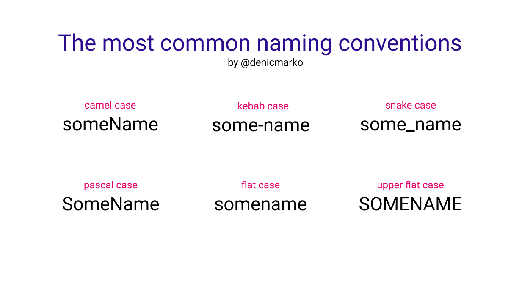

# Aulas 2023
-----------------------------------
snake_case
PascalCase
camelCase

aula 1 - 19/01

## Revisão git

### Navegação

1. checkout com -b

### Manipulção de commits

1. commit -m 
1. reset
1. commit --amend
1. add

### Configuração

1. remote add nomeVariavel EndereçoRepoRemoto
1. remote -v
1. config --global username nomeDoUsuario
1. config --global email email@DoUsuario.com

## Revisão Python

### Ambiente Virtual 

1. Python3 -m venv nomeDoAmbiente
1. source nomeDoAmbiente/bin/activate

### Arquivo de dependencia 

1. requirements.txt

### Instalação de dependencias

1. pip install -r requirements.txt
